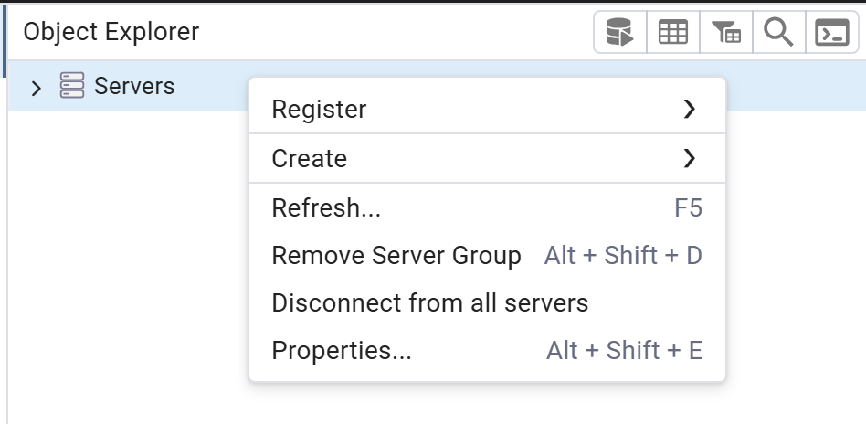
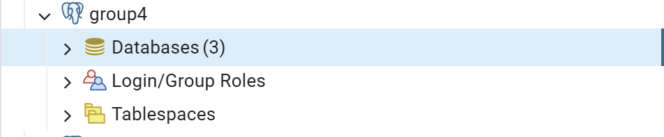

Single‑Scan Traceability Quest
=============================================================

Google docs:
https://docs.google.com/document/d/1JFQC1sF5lLrDW2v26Acps6JdZBTJdyL1oB0HNf6tVbo/edit?usp=sharing

Coursework brief:
https://ele.exeter.ac.uk/pluginfile.php/5542027/mod_resource/content/1/COMM2020%20Team%20project%20Coursework%20brief.pdf

**Steps for Setting up the Database locally**
=============================================================

PostgreSQL (with PGadmin) needs to be installed

Download the .sql file

Open PGadmin

Right click Servers

Register > Server

Name: Innovation-Group (can be anything)

Go to Connection tab

Hostname: localhost
Port: 5432
Username: postgres
Password: 1234

Save Server

Click Drop down on the Server

Right Click Databases

Create new database

Name: testDB
Owner: postgres

Save

right click testDB  

Restore

Format: Custom or tar
Filename: select the file

Restore

Complete

